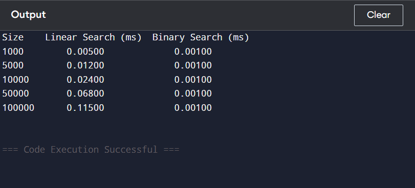

# Linear Search vs Binary Search

## Aim
To compare the performance of Linear Search and Binary Search algorithms by measuring the execution time for different input sizes.

## Algorithms Used
- Linear Search
- Binary Search

## Tools & Language
- Language: C
- Compiler: GCC
- Libraries Used: stdio.h, stdlib.h, time.h

## Methodology
1. Arrays of different sizes are generated.
2. The key element is searched using Linear Search.
3. The same key is searched using Binary Search on a sorted array.
4. Execution time for both algorithms is measured.
5. The results are compared.

## Sample Output

## Observations
- Linear Search execution time increases as the array size increases.
- Binary Search execution time remains almost constant and increases very slowly even when the array size increases.

## Conclusion
Binary Search is more efficient than Linear Search for large datasets because it follows a divide-and-conquer approach and has logarithmic time complexity.

## Note
Execution time may vary depending on the system configuration and compiler used.
